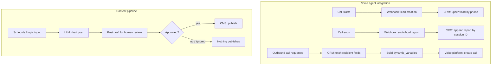

# AI Operations Stack

The integration layer wired around two third-party AI products — a voice-agent phone system and
an AI content-generation pipeline — so both behave as one system with the business's CRM and
publishing workflow, instead of two disconnected tools bolted onto the side.

> Sanitized write-up. Real client/business names, board IDs, and credential references are
> withheld. Two of the four underlying n8n workflows described here are confirmed live via a
> direct API query (name, active/inactive state, dates); node-level detail wasn't retrievable for
> the older workflows in that set (n8n's per-workflow MCP detail access was switched off, and
> flipping it on a live production workflow was out of scope for a read-only pass). Sanitized
> reference structures live in
> [`ai-systems-lab/voice-agent-webhooks`](https://github.com/abbassaeedza/ai-systems-lab/tree/main/voice-agent-webhooks)
> and
> [`ai-systems-lab/human-in-the-loop-content`](https://github.com/abbassaeedza/ai-systems-lab/tree/main/human-in-the-loop-content) —
> both explicitly labeled as reconstructions, not literal exports.

## Role / Context

- **Role**: sole engineer, integration layer around two vendor AI products.
- **Type**: employer project (sanitized).
- **Status**: live — voice-agent webhooks and the primary content-automation workflow are active;
  a second content-automation instance (built for a separate business) and two setup/outbound-call
  workflows are currently inactive.

## The problem

Two AI products got adopted independently — a voice-agent phone system and an LLM content
generator — each with its own dashboard and its own idea of what "done" means for a lead or a blog
post. Neither one, on its own, updates the CRM or publishes content safely: a voice AI that doesn't
write call outcomes back into the CRM just creates a second system of record, and a content AI that
publishes straight to a live site removes the one checkpoint that catches a wrong fact or an
off-brand paragraph before it's public. The job wasn't building either AI product — it was building
the seams that make each one accountable to the business's existing systems.

## Architecture

## What I built

- A lead-creation webhook that upserts a CRM record the moment an AI-handled call starts, keyed on
  phone number so repeat calls never fork into duplicate leads.
- An end-of-call report path that appends outcome, duration, and a recording reference to the same
  lead record by session ID — full call context lives in the CRM, not locked in the voice
  platform's own dashboard.
- An outbound-calling path that pulls CRM fields and passes them into the voice platform's
  create-call API as dynamic variables, personalizing the agent's script per recipient without a
  human building call lists by hand.
- A content pipeline that drafts a post from a topic input, then stops at a human-review checkpoint
  — an explicit approval signal is required before the publish step ever fires — built independently
  for a second business on top of the same draft → review → publish shape.

## Technical decisions

- **CRM as the single source of truth, not the voice platform.** Every voice-platform event round-trips
  back into the CRM. The alternative — treating the voice platform's own dashboard as the record of
  truth — means a rep has to check two systems to know a lead's real status, which in practice means
  nobody checks the second one consistently.
- **Draft, never auto-publish.** The content pipeline's publish step only fires on an explicit
  approval signal. This mirrors the same choice already made in `natural-language-ops-assistant`'s
  email-triage path (draft a reply, never auto-send) — anything that becomes public or goes to a
  client gets a human checkpoint, even where full automation is technically possible.
- **Personalization data comes from the CRM, not the voice platform.** Dynamic call variables are
  populated from CRM fields rather than hardcoded per campaign, so a script update to CRM data (a
  changed appointment time, a corrected name) is automatically reflected in the next outbound call
  without touching the voice platform's configuration.

## Hard parts

- **Two independent trigger sources writing to the same lead record without racing.** Call-start and
  call-end events for the same caller can arrive close together; keying both the lead upsert (by
  phone) and the report append (by session ID) on different, event-appropriate identifiers avoids a
  race where a fast end-of-call event could try to append to a lead record that hasn't been created
  yet.
- **Making "built twice" actually mean twice.** The content pipeline's second instance, for a
  separate business, needed its own topic source and CMS target rather than a copy-pasted
  configuration pointed at different credentials — the reusable part is the draft-review-publish
  shape, not a single hardcoded pipeline.

## Reliability

- Lead upsert is idempotent on phone number; a caller who calls twice never creates two records.
- End-of-call reports attach by session ID, so a busy day with many calls never misattributes a
  report to the wrong lead.
- The content pipeline's publish step requires an explicit approval signal — a stalled or ignored
  review simply means nothing publishes, never a silent default-to-live.

## Results

Both systems are running in production, not staged. The voice-agent webhook layer keeps the CRM
current without a human logging call outcomes by hand — every call, inbound or outbound, becomes CRM
state automatically the moment it happens. The content pipeline has shipped the same
approval-gated design twice, for two independent businesses, which is the actual claim being made
here: not a single client's one-off automation, but a pattern reached for by default when an AI
system's output can reach a customer or go public.

## Tech stack

n8n (webhook + schedule orchestration) · CRM API (upsert/append) · Voice-AI platform webhook +
outbound-call API · LLM content generation · Slack/email approval step · CMS publish API

## What this proves

I can wrap two separate third-party AI products in the integration discipline they don't ship with
on their own — CRM-as-source-of-truth for the voice agent, a mandatory human checkpoint for the
content pipeline — and I apply that same "keep a human in the loop on real-world-consequence
actions" judgment consistently, not just where a vendor happened to build it in.
