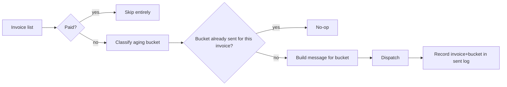

# AI Payment Reminders

An escalating invoice-reminder system that sends the right tone at the right time — a friendly
nudge before an invoice is even late, then progressively firmer follow-ups — without ever
double-sending or losing track of what's already gone out.

> **Clean-room demo.** This is a from-scratch reimplementation of a pattern from a real client
> engagement (a payments/invoicing reminder system), not an export of that system — no real
> invoice, client, or usage data exists anywhere in this write-up or the linked code. Working code
> lives in [`ai-systems-lab/ai-payment-reminders`](https://github.com/abbassaeedza/ai-systems-lab/tree/main/ai-payment-reminders).

## Role / Context

- **Role**: sole engineer.
- **Type**: independent/consulting project (clean-room demo — see note above).
- **Status**: demo, not a live production export.

## The problem

Manually tracking which invoices are late and remembering to chase each one — at the right moment,
with the right tone — doesn't scale past a handful of clients. Too early and a nudge feels
premature; too late and a firm message that should've gone out at day 20 goes out at day 45 instead,
after the relationship's already strained. The system needs to know exactly how overdue an invoice
is and match the message to that, automatically, without ever nagging someone who already paid or
sending the same reminder twice.

## Architecture

## What I built

- **Bucket-transition idempotency instead of a fixed schedule.** State is keyed on
  `(invoice_id, bucket)`, not "day 3 / day 10 / day 20." An invoice only triggers a new reminder
  when its *aging bucket* changes — due_soon → overdue_1_15 → overdue_16_30 → overdue_31_plus —
  never on a timer that can drift out of sync with reality.
- **Escalating tone mapped directly to aging bucket**: a heads-up before the due date, a plain
  status check shortly after, a firmer message past two weeks, and a request for a call past 30
  days — four buckets, four message templates, one classification function deciding which applies.
- **Paid invoices excluded before classification runs**, not filtered afterward — removes an entire
  class of race condition where a reminder could otherwise fire for an invoice that was just paid.

## Technical decisions

- **Why bucket-keyed state instead of a cron-style schedule**: a fixed-interval reminder system
  (send on day 3, day 10, day 20) silently breaks the moment a run is late, skipped, or re-run — it
  either double-sends or drops a step. Keying off the bucket the invoice's *current* aging actually
  produces means a resumed run after any gap lands exactly where reality is, with no separate
  "which reminder number are we on" counter that can get out of sync.
- **Provider-agnostic dispatch.** The demo logs a "sent" record rather than calling a real
  email/SMS API — the interesting engineering problem here is the state machine deciding *whether*
  and *what* to send, not which vendor API delivers it; wiring a real provider in is a thin,
  swappable layer on top.

## Hard parts

Getting the idempotency boundary right: the temptation is to key on invoice ID alone ("have we
reminded this invoice at all?"), which silently stops escalating after the first reminder. Keying on
`(invoice_id, bucket)` instead means each bucket transition is its own event — the system keeps
escalating as an invoice ages, while still never repeating the same bucket's reminder twice.

## Reliability

- Re-running the same cycle on the same day is always a no-op — verified directly in the module's
  self-check (first cycle dispatches, an identical same-day re-run dispatches nothing).
- Aging an invoice forward and re-running triggers exactly one new reminder per bucket crossed, not
  a backlog of every bucket it passed through — the self-check confirms this too.
- A paid invoice never reappears in any cycle's output, regardless of how many cycles run after it's
  marked paid.

## Results

This is a demo, not a system with production usage numbers to report — the result being defended
here is the design: escalation state that tracks the invoice's real aging rather than a schedule
that can drift, verified by a self-check that specifically exercises the same-day-no-op and
aged-forward-fires-once cases rather than just a happy path.

## Tech stack

Python, stdlib only (`dataclasses`, `datetime`) — no external dependencies or API keys required to
run the demo.

## What this proves

I default to keying state off the actual condition a system is tracking, not a wall-clock schedule
— because schedule-based designs are exactly the ones that break under the routine failure modes
(a missed run, a late start, a re-run) that happen constantly in real deployments. The same
discipline (idempotent, resumable, state-driven rather than timer-driven) shows up in the
`revenue-systems-lab` and `natural-language-ops-assistant` systems elsewhere in this portfolio —
it's a repeated pattern, not a one-off.
