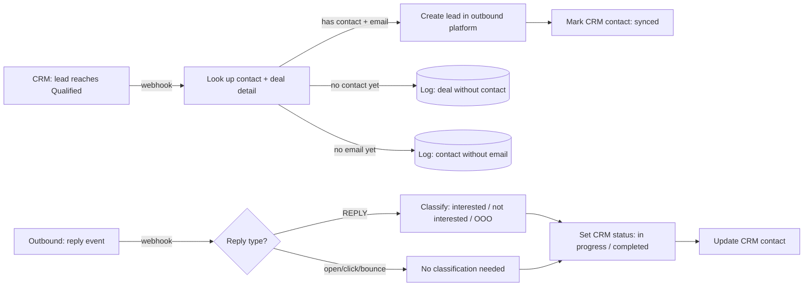

# CRM Outbound Sync

A bidirectional sync between a CRM's lead lifecycle and an outbound sending platform: a lead reaching "qualified" in the CRM automatically becomes an outbound lead, and a reply on the outbound side automatically updates the CRM — closing a loop that would otherwise need a person watching both systems.

> Sanitized write-up. Real company name, campaign identifiers, and CRM-internal field names are withheld. Architecture and pattern are real.

## Role / Context

- **Role**: sole engineer.
- **Type**: employer project (sanitized).
- **Status**: live.

## The problem

Lead qualification already happens inside the CRM's own automation — a lead moves through lifecycle stages (e.g. reaching "qualified," or getting marked "lost, recheck in 60 days" if it stalls). Without a sync, someone has to notice a lead just got qualified and manually add it to an outbound sequence, then notice a reply came in and manually update the CRM. Both directions are the kind of small, repetitive, easy-to-forget task that quietly rots a pipeline's data quality over time.

## Architecture

## What I built

- **Two small, single-direction workflows instead of one bidirectional monolith.** CRM→outbound and outbound→CRM have different triggers, payloads, and failure modes — keeping them separate means a change to reply-classification logic can't accidentally touch lead-creation logic.
- **Explicit non-dropping states for the two real gaps**: a qualified deal with no contact attached yet, and a contact with no email yet. Both get logged to their own side table instead of silently failing — both are common, expected states in a live CRM, not bugs.
- **A narrow, single-purpose reply classifier.** Only a genuine REPLY event triggers the LLM call — opens, clicks, and bounces skip it entirely, since there's no reply text to classify and no reason to spend a model call on them.
- **Explicit terminal-state rules**, not inferred ones: a NOT INTERESTED classification, or a reply on the final sequence step without an INTERESTED verdict, marks the CRM record COMPLETED; everything else stays IN PROGRESS.

## Technical decisions

- **Idempotency via a synced flag, not a lookup-then-create race.** Marking the CRM contact synced immediately after outbound lead creation means a redelivered webhook is a cheap no-op check, not a second query racing the first.
- **The CRM contact ID rides along as a custom field on the outbound lead.** That's the only piece of shared state the two workflows need — no separate mapping table, no polling either system for the other's state.
- **Reply classification is deliberately narrow** (three labels, nothing else) — a classifier with a wide-open label space is harder to act on downstream and harder to verify is behaving correctly.

## Hard parts

- Deciding what "qualified" should trigger required agreeing on it as a CRM-side contract, not an outbound-side assumption — this workflow trusts the CRM's own qualification logic completely and only starts once that decision has already been made upstream. Getting that boundary right (sync starts *after* qualification, never re-implements qualification) kept the two systems' responsibilities from blurring together.
- The reply classifier's OUT OF OFFICE label exists specifically because an early version conflated it with NOT INTERESTED, which was quietly marking real prospects COMPLETED while they were just on vacation.

## Reliability

- Both directions are individually idempotent — a redelivered webhook in either direction produces the same end state, not a duplicate or a flip-flop.
- Neither "no contact" nor "no email" is a hard failure — both degrade to a logged, visible side-table entry that a human can work from.

## Tech stack

n8n (orchestration) · a CRM's webhook + REST API · an LLM for reply classification · an outbound sending platform's REST API

## What this proves

I can build a sync between two systems that's driven by real lifecycle events (not a polling loop), where each direction is independently idempotent, and where every edge case the two systems can actually produce (no contact, no email, a redelivered event, an out-of-office reply) has an explicit, defined outcome instead of an implicit one.
