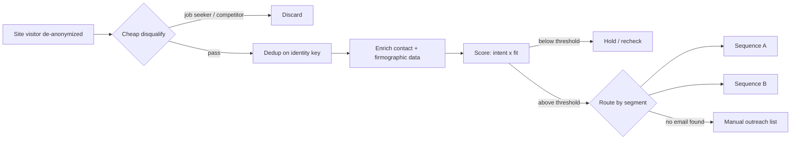

# Closed-Loop CRM ↔ Outbound Sync

A warm-inbound routing system: when an anonymous website visitor gets identified, the system decides in real time whether they're worth a sales touch, scores and resolves them, and routes them into the right outbound sequence — instead of dumping every site visitor into one generic list.

> Sanitized write-up. Real company name, campaign identifiers, and the business rationale behind specific score weightings are withheld. Architecture and pattern are real.

## Role / Context

- **Role**: sole engineer.
- **Type**: employer project (sanitized).
- **Status**: live — router built and running; downstream campaign activation is a separate, business-side gate (inbox provisioning), not an engineering blocker.

## The problem

Most inbound-routing setups treat "someone visited the website" as the signal. That's noisy — job seekers, competitors' own researchers, and genuinely interested buyers all look identical at that point. The system needed to cheaply disqualify the obvious noise, deduplicate against everyone already being worked, and only spend enrichment budget resolving contact details for visitors worth pursuing — then route each qualified visitor into the *right* sequence, not a single generic one.

## Architecture

## What I built

- **A cheap-disqualify stage before any paid enrichment runs** — filters out visitors who are structurally never going to convert (job seekers, competing vendors) using free, already-available signals, so the expensive enrichment step never wastes a lookup on them.
- **A weighted intent × fit scoring formula** that separates "is this person likely ready to buy" from "is this person even in our target market" as two independent scores, then combines them — rather than one blended number that can't distinguish a high-fit-low-intent visitor from a low-fit-high-intent one.
- **Segment-aware routing**: qualified visitors don't all land in one sequence — the routing step reads a segment signal and sends different visitor types into differently-tuned outbound sequences.
- **A no-email fallback path**: visitors who clear the score threshold but can't be resolved to an email don't get silently dropped — they fall through to a separate manual-outreach list instead of disappearing.
- **Reply-triggered subsequences**: an inbound reply auto-triggers delivery of the specific content the sequence promised, closing the loop without a human having to notice the reply and act on it manually.

## Technical decisions

- **Two independent scores instead of one blended score.** A single combined "lead score" hides *why* a lead qualified, which makes the routing decision opaque. Keeping intent and fit as two separate inputs to a final weighted formula made the routing logic auditable — a low-fit-high-intent lead and a high-fit-low-intent lead reach the threshold differently and can be routed differently if the business ever wants that.
- **Dedup on identity, not on session.** Site-visit sessions are cheap and noisy; deduplicating on a stable identity key means the same real person visiting twice in one day doesn't generate two separate enrichment spends.
- **Never silently drop a qualified lead.** The decision to route unresolved-but-qualified visitors to a manual list instead of discarding them came directly from watching the alternative: every dropped lead is invisible, so there's no way to know later whether the resolution step is under-performing.

## Hard parts

- The disqualify stage has to run on free/cheap signals *before* enrichment, which means it has to be conservative — a disqualify rule that's too aggressive silently kills good leads with no visibility into what was dropped, which is a much harder failure mode to catch than a rule that's too lenient (which just costs a bit more enrichment budget). Tuned toward "let a few noisy ones through" rather than "risk killing a real lead," because the failure is asymmetric.
- Getting the score threshold right required treating it as a business-tunable number, not a hardcoded constant — the pipeline reads it as configuration specifically because "what counts as qualified" is a decision that changes as the business's targeting sharpens, not an engineering constant.

## Reliability

- Every stage writes to a durable store before the next stage reads it — no in-memory hand-off between disqualify, dedup, enrich, score, and route, so any stage can be re-run independently without re-processing the whole pipeline.
- The no-email fallback path exists specifically so a partial failure (can't resolve contact info) degrades to "human follow-up needed" instead of "lead silently lost."

## Results

Deliverability, sender-domain, and reply-rate figures for the outbound sequences this feeds are the same numbers documented in the [Intent-Based Outbound Pipeline](../intent-based-outbound-pipeline/) case study — this router is a feeder into the same sending infrastructure, not a separately-measured system.

## Tech stack

n8n (orchestration) · A visitor de-anonymization data source · A contact-enrichment API · A CRM/outbound sending platform · Weighted scoring logic in code

## What this proves

I can design a routing decision as a small set of composable, auditable stages (disqualify → dedup → enrich → score → route) instead of one opaque scoring blob — and I bias toward "never silently drop a qualified lead" as a default engineering posture, which matters more in a revenue system than almost anywhere else, because a dropped lead has no error log; it just never converts and nobody knows why.
