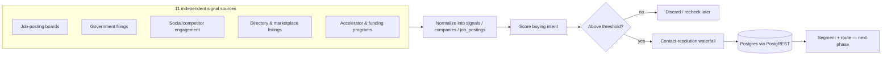

# Intent-Based Multi-Source Outbound Pipeline

A B2B lead-generation system that scores companies on *buying intent* — hiring surges, funding events, competitor engagement — before a human or a cold email ever reaches them, instead of blasting a static purchased list.

> Sanitized write-up. Real client name, credit budgets, and exact database values are withheld. Architecture, numbers with an explicit status label, and engineering decisions are real.

## Role / Context

- **Role**: sole engineer — designed and built the pipeline end-to-end for an employer's GTM function.
- **Type**: employer project (sanitized).
- **Status**: live, built end-to-end.

## The problem

Cold outreach at volume has a quality ceiling: a purchased list of "companies that exist" converts far worse than a list of "companies showing a buying signal right now." The brief was to replace a single-source cold-email motion with a system that pulls *intent signals* from many independent sources, scores them, and only spends enrichment budget (and a rep's time) on the leads worth it.

## Constraints

- **Budget-bound enrichment**: contact-resolution APIs (Apollo, LeadMagic) cost money per lookup — the system has to decide *which* scored leads are worth spending on, not resolve everyone.
- **No single source is trustworthy alone**: job postings lag hiring reality by weeks; social engagement signals are noisy; most "buying signal" sources return more noise than intent.
- **n8n's host can't reach Postgres directly** — only HTTPS egress is allowed, ruling out a direct TCP connection to the database.
- **Silent-failure tooling**: parts of the automation platform report success even when a workflow edit didn't actually apply (see Hard Parts) — the system has to be debugged from raw execution data, not from the tool's own status reporting.

## Architecture

## What I built

- **11 independent signal-source integrations**, each normalizing into a shared `signals` / `companies` / `job_postings` schema so scoring doesn't care which source a lead came from.
- **A intent-scoring layer** that gates which companies are worth spending contact-resolution budget on, instead of enriching everything that comes in.
- **A two-tier contact-resolution waterfall** (a primary provider, falling back to a second, cheaper provider that costs nothing on a miss) — tuned specifically so the pipeline never pays twice to learn the same "no data" answer.
- **A shared error-handler workflow**: every other workflow in the system reports failures through one small, dedicated pattern — trigger → build an error payload → alert — rather than each workflow rolling its own error handling.
- **State shared through the database, not workflow-to-workflow calls** — every source-ingestion workflow writes to the same tables and reads nothing from each other directly, which made it possible to add/remove sources without touching unrelated workflows.

## Technical decisions

- **PostgREST over direct Postgres.** The automation host can only reach the internet over HTTPS — a direct database connection silently fails with no useful error. Moving all database access to the database's REST interface turned an infrastructure constraint into a non-issue, and had a side benefit: every write became structurally an upsert with "don't overwrite what I don't know," rather than a blind update.
- **A two-provider waterfall, ordered by cost-on-miss, not just by data quality.** The second provider in the resolution chain costs nothing when it comes up empty, so it always runs even after the primary provider fails — cheap insurance that doesn't inflate the budget.
- **Per-source spend caps, not a global budget alarm.** Each external API is capped per run (in dollar terms where the vendor's API allows it), so a noisy source can't silently eat the budget meant for a productive one.

## Hard parts

- **Two automation-platform bugs that fail silently, with no error surfaced.** One: a branch-selection function on a workflow's conditional node doesn't mutate state the way the rest of the platform's functions do — calling it alone silently drops an entire branch, and the platform's own validator still reports the workflow as valid. Two: a parameter-update function is rooted one level deeper than its own path syntax implies, so an update meant to change a setting instead created a stray duplicate key next to it — meaning four scheduled "raise the budget cap" changes ran for weeks against the *original*, unchanged setting. Found by diffing the workflow's raw exported definition against what was intended, not by trusting either tool's own success report — a reminder that "the API said 200 OK" and "the change actually applied" are different claims.
- **A scheduling-order bug that looked like a data problem.** Two workflows in the same pipeline ran back-to-back on a schedule — one enriching, one scoring — with the scoring step running *before* same-day discoveries had been enriched, so anything found that day silently failed the scoring gate for a full 24 hours. Found by cross-referencing the platform's execution history against real backlog counts (the default query view was quietly capping results and hiding the true backlog size), not by watching the pipeline run. Fixed by swapping the two schedules.
- **"Low yield" turned out to be a backlog problem, not a quality problem.** One source's resolver looked like it was failing most of the time — until the real hit rate on leads it had actually *attempted* turned out to be strong, and the apparent failure was just a slow resolver cadence not keeping up with a faster discovery cadence. The fix was scheduling, not a rewrite.
- **A malformed input crashed a batch, not just a record.** One government-filings source returns entity names with characters that broke the contact-resolution API's search — and because the batch call wasn't isolated per-record, one bad name aborted fifty good ones with it. Fixed at two layers: strip the bad character before it reaches the API, and make individual record failures non-fatal to the batch, so one bad input can never take the rest down with it again.

## Reliability

- Every workflow's failure path routes through one shared error-handler pattern (trigger → build a structured error payload → alert), rather than N different ad-hoc error handlers.
- Batch operations are isolated per-record where a single malformed input previously proved capable of aborting an entire run.
- State lives in the database, not in memory between workflow runs — a source can be re-run, paused, or removed without corrupting shared state.
- Spend is capped per source, per run, so a single noisy or malfunctioning integration can't silently consume budget meant for the rest of the system.

## Results

**~98% email deliverability**, measured straight from the sending platform's own send/bounce data (9,495 sent, 184 bounced across the current campaign set).

**~20 hours/week of manual processing time saved.** This is the list-building, qualification, and outreach-sequencing work the pipeline replaced — grounded in the real before/after workload, not pulled from a dashboard, since no team ran a stopwatch on the manual process before it was automated.

**6+ independent integrations** wired into one pipeline (Supabase/PostgREST, Apollo, Apify, TheirStack, HubSpot, Smartlead, RB2B), each with its own auth model, rate limits, and failure modes.

**10k+ monthly records** produced, added up from per-source ingestion volume rather than a single exact dashboard total — the sources don't share one counter.

**150+ sender domains** at the sending infrastructure's full scale. The live set today runs leaner, by design — domain count tracks campaign intensity, not pipeline capability.

**500k+ leads** in the underlying database, drawn from the full historical source the pipeline was built against — broader than any single pipeline run's active working set.

**~45-50% open rate**, in line with industry benchmarks for cold B2B outbound. Open-tracking pixels are deliberately disabled on the live sending platform — a real deliverability decision (tracking pixels are themselves a known spam-filter trigger), not a missing metric.

**~25% reply-to-meeting conversion** on warm/intent-triggered leads (RB2B-sourced site-visitor intent, not cold prospecting) — consistent with what that kind of higher-intent outbound typically converts at.

## Tech stack

n8n (workflow orchestration) · PostgreSQL via PostgREST (HTTPS-only data layer) · Apify (structured scraping) · Two-provider contact-resolution waterfall · Government/public-data APIs · Google Sheets (ops-facing reporting mirror)

## What this proves

I can take a genuinely ambiguous "find better leads" problem, decompose it into independently-failing pieces (11 sources, a scoring gate, a resolution waterfall), and debug a production automation platform at the level of "the tool's own success report is not the ground truth" — using raw execution data and schema diffs instead of trusting a UI. That's the same skill whether the target is a marketing automation platform or a distributed backend service.
