# Natural-Language Ops Assistant

A chat, email, and scheduled-digest assistant sitting in front of a project-management board for a
digital marketing agency managing multiple clients — answers questions with live board data and
argued recommendations, instead of a static dashboard someone has to remember to check.

> Sanitized write-up. Real client/agency name, board IDs, and credential references are withheld.
> The workflow graph, prompts, and logic are real — a sanitized export lives in
> [`ai-systems-lab/natural-language-ops-assistant`](https://github.com/abbassaeedza/ai-systems-lab/tree/main/natural-language-ops-assistant).

## Role / Context

- **Role**: sole engineer.
- **Type**: independent/consulting project (sanitized).
- **Status**: live, in production use.

## The problem

An agency running multiple client accounts on one project-management board had the data to answer
"what's on fire today" and "what needs my attention" — but getting that answer meant opening the
board, scanning every group, and mentally reconstructing priority. Nobody was going to do that
consistently every morning, and the same question kept arriving over chat and email in ad-hoc form.
The system needed to answer natural-language questions with real board state, and separately, catch
incoming client emails and decide whether they needed a new task, an update to an existing one, or
nothing at all.

## Architecture

```mermaid
flowchart TB
    subgraph Chat
        W[Webhook: chat message] --> PB[Parse body + context]
        PB --> IC[GPT: classify intent]
        IC --> SW{Switch on intent}
        SW -->|data intents| MQ[Query board via GraphQL]
        MQ --> FMT[Format result]
        FMT --> ADV[GPT: argue from data]
        SW -->|general_advice| ADV
        ADV --> R[Respond to webhook]
    end
    subgraph Email triage
        GT[Gmail trigger] --> MATCH[Match sender to board item]
        MATCH --> EC[GPT: create / update / ignore]
        EC -->|create or update| GEN[GPT: draft task + Slack + email]
        GEN --> SLK[Slack alert]
        GEN --> DRAFT[Gmail draft, not sent]
        GEN --> BOARD[Update board]
    end
    subgraph Daily digest
        CRON[Schedule trigger] --> PULL[Pull full board]
        PULL --> DIG[GPT: time-blocked agenda]
        DIG --> SLK2[Slack digest]
    end
```

## What I built

- **Intent classification before any board query.** A small GPT call returns one of six intents as
  strict JSON; a Switch node routes on it. `general_advice` skips the board entirely — the system
  only pays for a data fetch when the question actually needs one.
- **A two-call structure, not one prompt doing everything.** Classify first (cheap, checkable,
  logged), then a second call with a persona system prompt argues from the fetched data — flags
  risk, recommends a next action — rather than one long prompt trying to both parse intent and
  reason over data at once.
- **Inbound-email-to-task triage**: a Gmail trigger matches incoming email to a client by sender
  domain/email against the board, then an LLM decides `create` / `update` / `ignore` against that
  client's *existing* open tasks — so a reply to something already tracked doesn't spawn a duplicate.
- **Human-in-the-loop on the one channel with real consequences.** The email path never auto-sends:
  it produces a Gmail **draft** for review, while the Slack notification and board update fire
  immediately — full automation on the low-stakes side, a review gate on the side that talks to a
  client.
- **A scheduled proactive layer** on top of the two reactive paths: a daily cron job pulls the whole
  board and asks the model for a structured, time-blocked agenda (top priorities, risks, an explicit
  "ignore today" list) — the same board, three different consumption patterns.

## Technical decisions

- **Splitting classification from response generation.** A single prompt asked to both parse intent
  *and* generate the final answer either over-fetches (always query the board "just in case") or
  under-specifies (the model has to guess what data it needs mid-generation). Two calls means the
  routing decision is inspectable on its own — log the classifier's JSON output and you know exactly
  why a given branch fired, independent of whatever the second call said.
- **Draft, don't send.** For the email-triage path specifically, the cost of a wrong LLM decision
  isn't a bad log line, it's an email a real client reads. Every other action in the system (Slack
  posts, board updates) fires automatically; the one action facing a client stops one step short.
- **Match by domain, not just exact address**, when resolving an inbound email to a client — a
  contact who emails from a personal address instead of their tracked one still resolves correctly,
  rather than silently falling through to "no match."

## Hard parts

- Getting the intent classifier to reliably default to `general_advice` on anything ambiguous,
  rather than force-fitting a data intent, mattered more than getting the six categories exactly
  right — a wrong "sounds like a data question" classification means an unnecessary board query and
  a worse answer; a wrong "sounds conversational" classification just means one fewer live-data
  citation in an otherwise-fine response. Biased the fallback toward the cheaper failure mode.
- The classifier's raw output isn't guaranteed clean JSON (markdown fences, stray text) — parsing it
  defensively (strip fences, `try/catch` around `JSON.parse`, fall back to `general_advice` on any
  parse failure) turned an occasional hard failure into a silent, safe degradation instead.

## Reliability

- Malformed or empty input short-circuits to a friendly fallback reply before any model or API call
  runs.
- The intent-classification step is defensively re-parsed with a safe default, so a malformed
  classification degrades the conversation instead of erroring the whole webhook.
- The email-triage path's only externally-visible action on `create`/`update` is a drafted (not
  sent) email plus an internal Slack alert and board update — a wrong classification is reviewable,
  not irreversible.

## Results

The system replaced a manual "open the board and scan every group" habit with three lower-friction
paths into the same data: ask a question directly, let an inbound email get triaged automatically
into the right task action, or read a daily digest that's already prioritized. The strongest signal
this pattern holds up isn't a usage metric — it's that the same "classify before acting, keep a
human in the loop on client-facing output" structure is the one used across the chat, email, and
digest paths, not three different ad-hoc designs bolted onto one board.

## Tech stack

n8n (workflow orchestration) · Monday.com GraphQL API · OpenAI (two-stage: intent classification +
persona response generation) · Gmail (trigger + draft, not send) · Slack

## What this proves

I can scope an LLM's job tightly inside a larger system — classify, then argue from real data —
instead of asking one model call to do everything, and I default to a human-review gate on the one
action that touches a real client relationship even when full automation is technically available
everywhere else in the same system.
