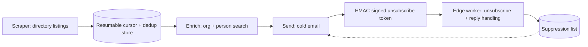

# White-Label Outreach Pipeline

A standalone, compliance-aware outbound pipeline: scrapes a public agency directory, enriches company and contact data, and sends a compliant cold-email pitch — with real anti-abuse and legal-compliance mechanics, not just a send script.

> Sanitized write-up. Real target directory, sending domain, and client identity are withheld. Architecture, compliance mechanism, and stack are real.

## Role / Context

- **Role**: sole engineer.
- **Type**: employer project (sanitized).
- **Status**: code-complete, tested offline.

## The problem

This pipeline needed to run as a separate, on-demand system from the always-on signal pipeline — scrape a directory of agencies, enrich them, and send a cold pitch — while staying legally compliant (CAN-SPAM requires a working, honored unsubscribe mechanism) and resilient to the two things that kill scrapers in practice: getting blocked mid-run, and losing all progress on a crash.

## Architecture

## What I built

- **A resumable scraper** with a persisted cursor and a domain-level dedup store, so a crash or a manual stop mid-run loses zero progress — the next run picks up exactly where the last one stopped, and never re-processes a domain it already has.
- **A three-tier fetch strategy** (direct request → proxy → skip) so a single blocked request degrades to a fallback instead of aborting the run.
- **A contact-enrichment step** that takes scraped company records and resolves them to real organizations and decision-makers via a search-then-reveal pattern, rather than sending to a scraped name with no verification.
- **HMAC-signed one-click unsubscribe tokens**, verified and honored by a small edge worker that doubles as the reply-handling endpoint — so unsubscribe and reply-capture share one piece of infrastructure instead of two.
- **A production orchestration layer** on top of the standalone scripts: a scheduled workflow ingests scraper output and runs the enrich/send steps on a daily cadence, so the on-demand scripts became a repeatable, unattended pipeline rather than something run by hand.

## Technical decisions

- **HMAC tokens over a database-backed unsubscribe lookup.** A signed token means the unsubscribe link is self-verifying at the edge — no database round-trip needed to confirm a request is legitimate before honoring it, and no way to forge an unsubscribe/resubscribe request without the signing key.
- **One edge worker for both unsubscribe and reply handling.** Both are "an inbound signal about an outbound send" — routing them through the same small service kept the surface area to one deployable unit instead of two half-maintained ones.
- **Direct → proxy → skip, not direct → fail.** Treating a blocked request as "try the next strategy" rather than "abort" kept the scraper's overall completion rate high even against sites with inconsistent bot-blocking.

## Hard parts

- Getting the resumable-cursor design right meant treating "already seen" as a durable fact checked *before* any network request, not something discovered after a duplicate scrape completed — otherwise a resume after a crash would still waste time and requests re-fetching pages it already had.
- The unsubscribe worker has to be trustworthy under adversarial conditions (a signed token can be replayed, or an attacker can probe for valid-looking tokens) — the HMAC scheme specifically closes both: a token replay just re-confirms an already-honored unsubscribe (idempotent), and a forged token fails signature verification before it ever reaches the suppression logic.

## Reliability

- Resumable by design — a mid-run crash or interruption costs zero re-work.
- Legally compliant by construction: every send carries a working, cryptographically-verified unsubscribe path, honored automatically with no manual step in the loop.
- Isolated from the always-on pipeline deliberately — a failure or a rate-limit event in this system can't cascade into the primary signal-ingestion pipeline, because they don't share infrastructure beyond the orchestration platform itself.

## Tech stack

Node.js · Browser automation (scraping) · A contact-enrichment API · A transactional email API · Cloudflare Workers (edge unsubscribe/reply handling) · n8n (scheduling/orchestration layer)

## What this proves

This is the non-n8n half of my outbound engineering work: a real edge service, a cryptographic verification scheme, and a resumable-by-design scraper — the same "assume failure is normal, design for resumability and non-cascading isolation" instincts as the signal pipeline, applied outside a low-code platform.
